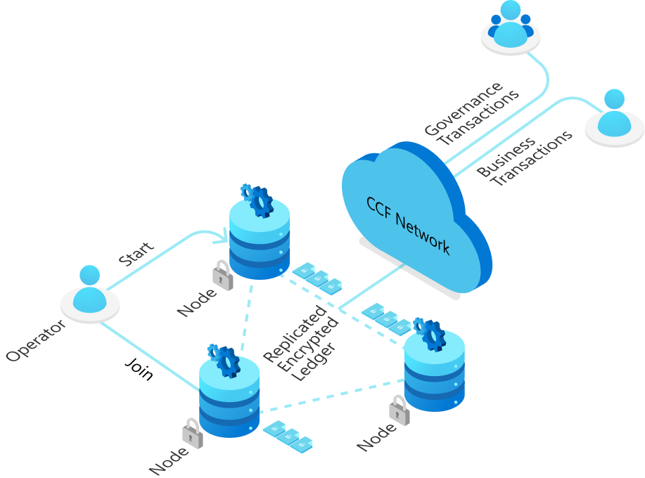

# The Confidential Consortium Framework  

The Confidential Consortium Framework (CCF) is an open-source framework for building a new category of secure, highly available, and performant applications that focus on multi-party compute and data.

## Get Started with CCF

- Read the [CCF overview](https://microsoft.github.io/CCF/main/overview/index.html) and become familiar with the [core concepts](https://microsoft.github.io/CCF/main/overview/what_is_ccf.html)
- [Install](https://microsoft.github.io/CCF/main/build_apps/install_bin.html) CCF on Linux
- Become familiar with the CCF core developer API with the [template CCF app](https://github.com/microsoft/ccf-app-template)
- Quickly build and run [sample CCF apps](https://github.com/microsoft/ccf-app-samples)
- [Build new CCF applications](https://microsoft.github.io/CCF/main/build_apps/index.html) in TypeScript/JavaScript or C++

## Contribute

- [Contribute](https://microsoft.github.io/CCF/main/contribute) to this repository, following the [contribution guidelines](.github/CONTRIBUTING.md)
- Submit [bugs](https://github.com/microsoft/CCF/issues/new?assignees=&labels=bug&template=bug_report.md&title=) and [feature requests](https://github.com/microsoft/CCF/issues/new?assignees=&labels=enhancement&template=feature_request.md&title=)
- Start a [discussion](https://github.com/microsoft/CCF/discussions/new) to ask a question or propose an idea

## Learn More

- Browse the [documentation](https://microsoft.github.io/CCF/)
- Read the [Research Papers](https://microsoft.github.io/CCF/main/research)

## Third-party components

We rely on several open source third-party components, attributed under [THIRD_PARTY_NOTICES](THIRD_PARTY_NOTICES.txt).

## Contributing

This project welcomes contributions and suggestions. Please see the [Contribution guidelines](.github/CONTRIBUTING.md).
