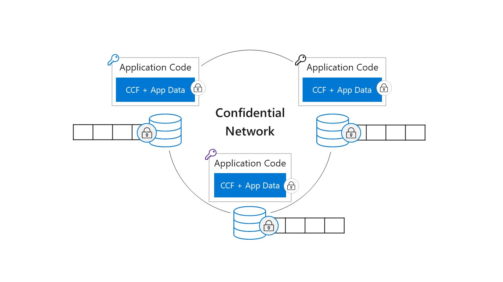

# The Confidential Consortium Framework

The Confidential Consortium Framework (CCF) is an open-source framework for building a new category of secure, highly available,
and performant applications that focus on multi-party compute and data. While not limited just to blockchain applications,
CCF can enable high-scale, confidential blockchain networks that meet key enterprise requirements
— providing a means to accelerate production enterprise adoption of blockchain technology.

Leveraging the power of trusted execution environments (TEEs), decentralized systems concepts, and cryptography,
CCF enables enterprise-ready computation or blockchain networks that deliver:

 * **Throughput and latency approaching database speeds.** Through its use of TEEs, the framework creates a network of remotely attestable enclaves.
   This gives a web of trust across the distributed system, allowing a user that verifies a single cryptographic quote from a CCF node to
   effectively verify the entire network. This simplifies consensus and thus improves transaction speed and latency — all without compromising security or assuming trust.

 * **Richer, more flexible confidentiality models.** Beyond safeguarding data access with encryption-in-use via TEEs, we use industry standards (TLS and remote attestation)
   to ensure secure node communication. Transactions can be processed in the clear or revealed only to authorized parties, without requiring complicated confidentiality schemes. 

 * **Network and service policy management through non-centralized governance.** The framework provides a network and service configuration to express and manage consortium
   and multi-party policies. Governance actions, such as adding members to the governing consortium or initiating catastrophic recovery, can be managed and recorded through
   standard ledger transactions agreed upon via stakeholder voting.

 * **Improved efficiency versus traditional blockchain networks.** The framework improves on bottlenecks and energy consumption by eliminating computationally intensive
   consensus algorithms for data integrity, such as proof-of-work or proof-of-stake.

## A consortium first approach

In a public blockchain network, anyone can transact on the network, actors on the network are pseudo-anonymous and untrusted, and anyone can add nodes to the network
— with full access to the ledger and with the ability to participate in consensus. Similarly, other distributed data technologies (such as distributed databases)
can have challenges in multi-party scenarios when it comes to deciding what party operates it and whether that party could choose or could be compelled to act maliciously. 
 
In contrast, in a consortium or multi-party network backed by TEEs, such as CCF, consortium member identities and node identities are known and controlled.
A trusted network of enclaves running on physical nodes is established without requiring the actors that control those nodes to trust one another
—  what code is run is controlled and correctness of its output can be guaranteed, simplifying the consensus methods and reducing duplicative validation of data. 



Microsoft has taken this approach in developing CCF: using TEE technology, the enclave of each node in the network (where cryptographically protected data is executed)
can decide whether it can trust the enclaves of other nodes based on mutual attestation exchange and mutual authentication, regardless of whether the parties involved
trust each other or not. This enables a network of verifiable, remotely attestable enclaves on which to run a distributed ledger and execute confidential and secure
transactions in highly performant and highly available fashion.

## A flexible confidentiality layer for any multi-party computation application or blockchain ledger to build upon

CCF currently runs on [Intel SGX](https://software.intel.com/en-us/sgx)-enabled platforms. Because CCF uses the [OpenEnclave SDK](https://github.com/Microsoft/openenclave)
as the foundation for running in an enclave, as OpenEnclave supports new TEE technologies, CCF will be able to run on new platforms. Networks can be run on-premises,
in one or many cloud-hosted data centers, including [Microsoft Azure](https://azure.microsoft.com/), or in any hybrid configuration.

Ledger providers can use CCF to enable higher throughput and higher confidentiality guarantees for distributed ledger applications.
CCF developers can write application logic (also known as smart contracts) and enforce application-level access control in several languages by configuring CCF
to embed one of several language runtimes on top of its key-value store. Clients then communicate with a running CCF service using JSON-RPC interfaces over TLS.

## Learn more and get started

 * Get a more detailed breakdown of CCF by reading the CCF Technical Report
 * Explore the CCF open-source GitHub repo, which also contains application examples and sample scripts for provisioning and setting up confidential computing VMs using Azure
 * Learn more about [Azure Confidential Computing](https://azure.microsoft.com/solutions/confidential-compute/) offerings like Azure DC-series (which support Intel SGX TEE)
   and [Open Enclave](https://github.com/Microsoft/openenclave) that CCF can run on

## Getting Started on Azure Confidential Computing

Under `getting_started/`:
 * `create_vm/` contains scripts to create an ACC VM (`make_vm.sh`).
   This script expects a valid Azure subscription name to be set, eg: `export SUBSCRIPTION=sub_name`
 * `setup_vm/` contains ansible playbooks that need to be run on the VM once created, for it to be able to build CCF.
   Running `./setup.sh` will apply those playbooks to the VM.

## Build and Test

```bash
mkdir build
cd build
cmake -GNinja ..
ninja
```

Run the tests.

```bash
cd build
python3.7 -m venv env
source env/bin/activate
pip install -r ../tests/requirements.txt
ctest
```

## Third-party components

We rely on several open source third-party components, attributed under [THIRD_PARTY_NOTICES](THIRD_PARTY_NOTICES.txt).

## Contributing

This project welcomes contributions and suggestions. Most contributions require you to
agree to a Contributor License Agreement (CLA) declaring that you have the right to,
and actually do, grant us the rights to use your contribution. For details, visit
https://cla.microsoft.com.

When you submit a pull request, a CLA-bot will automatically determine whether you need
to provide a CLA and decorate the PR appropriately (e.g., label, comment). Simply follow the
instructions provided by the bot. You will only need to do this once across all repositories using our CLA.

This project has adopted the [Microsoft Open Source Code of Conduct](https://opensource.microsoft.com/codeofconduct/).
For more information see the [Code of Conduct FAQ](https://opensource.microsoft.com/codeofconduct/faq/)
or contact [opencode@microsoft.com](mailto:opencode@microsoft.com) with any additional questions or comments.
