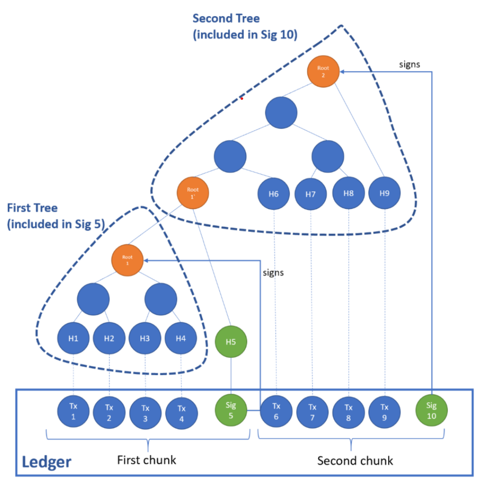

Audit
=====

The high-integrity guarantees of CCF are enforced by a single :term:`Merkle Tree` which records all transactions that mutate the key-value store. The root of the Merkle Tree is regularly signed by the primary node and the signature is recorded in the ``ccf.signatures`` key-value map. Like any other transaction, the signature transaction is also recorded in the ledger, which allows for offline auditability of the service.

.. note:: The :ref:`CCF Python package <quickstart/install:Python Package>` provides the ``ledger`` module to easily parse the ledger. More details :doc:`here <ledger_python>`.

The signature transaction also contains the Merkle Tree so far (note: the tree is compacted at regular interval to avoid infinite memory growth).

The following diagram demonstrates how the integrity of the ledger can be verified: two signature transactions (at ``seqno`` 5 and 10) sign the root of the Merkle Tree so far (after ``seqno`` 4 and 9, respectively). The auditor can reconstruct the Merkle Tree by walking through the ledger, hashing the transactions recorded in the ledger and appending them to a fresh Merkle Tree. On every signature transaction, the reconstituted root can be compared to the one recorded in the signature transaction. The signature can be verified using the public signing key of the primary node at the time (also recorded in the ledger -- see ``ccf.nodes`` map). If the signature and root match, the integrity of the ledger so far is guaranteed.

..
..

.. toctree::
    :maxdepth: 1
    :caption: More details:

    ledger
    ledger_python