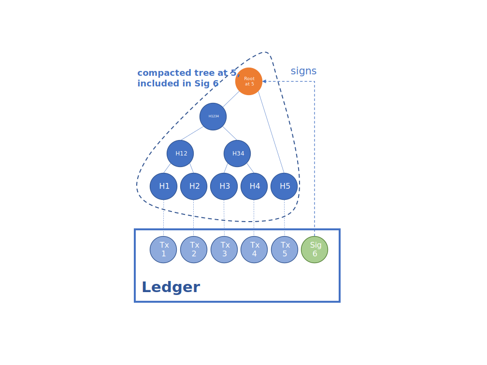
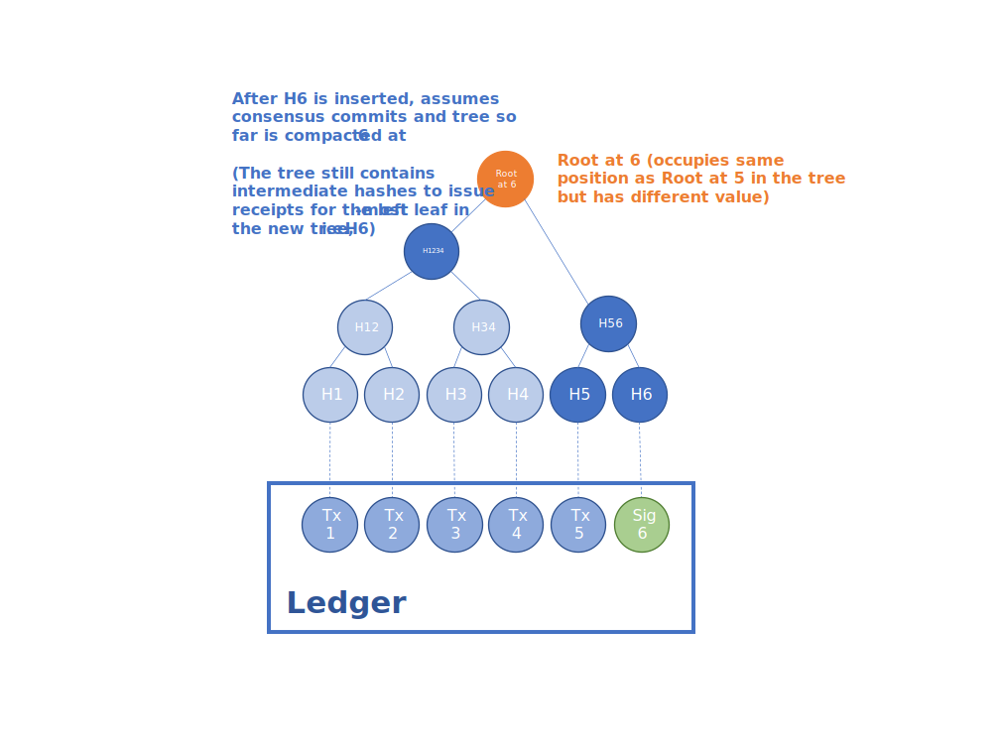
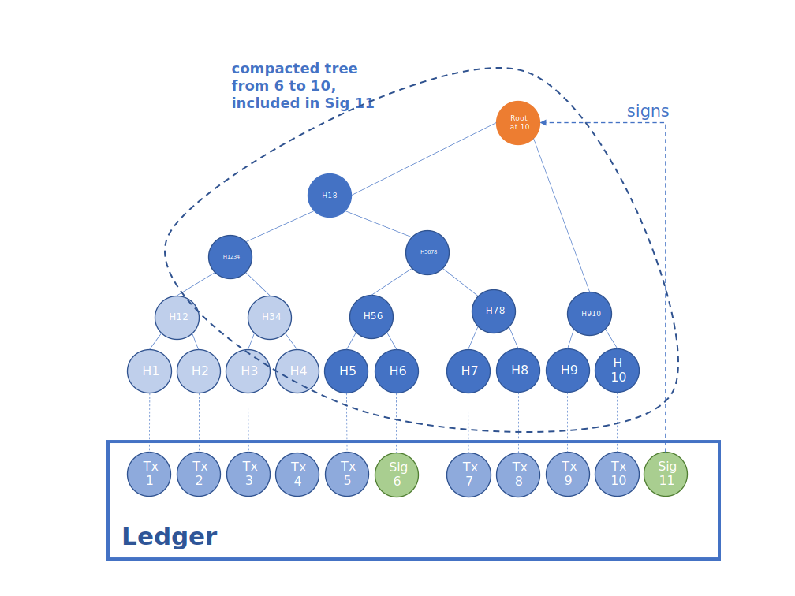

Merkle Tree
===========

.. note:: The :doc:`CCF Python package </use_apps/python_tutorial>` provides the ``ledger`` module to easily parse the ledger. More details :doc:`here <python_library>`.

The high-integrity guarantees of CCF are enforced by a single :term:`Merkle Tree` which records the cryptographic hash (leaves) of all transactions that mutate the key-value store. The root of the Merkle Tree is regularly signed by the primary node and the signature is recorded in the ``public:ccf.internal.signatures`` key-value map. Like any other transaction, the signature transaction is also recorded in the ledger, which allows for offline auditability of the service (for both governance and application history).

The following diagram demonstrates how the integrity of the ledger can be verified: a signature transaction (at ``seqno`` 6) signs the root of the Merkle Tree so far (after the transaction at ``seqno`` 5 has been recorded).

Auditors of the CCF ledger can reconstruct the Merkle Tree by walking through the ledger, hashing the transactions recorded in the ledger and appending them to a fresh Merkle Tree. On every signature transaction, the reconstituted root can be compared to the one recorded in the signature transaction. The signature can be verified using the public signing key of the primary node at the time (also recorded in the ledger -- see ``public:ccf.gov.nodes`` map). If the signature and root match, the integrity of the ledger so far is guaranteed.

.. note:: The signature transaction also contains the hash of the transactions signed since the last signature. This allows CCF to efficiently issue receipts for historical transactions by only reading the signature transaction that follows the target transaction in the ledger.

To reduce the memory footprint of the Merkle Tree as more transactions are recorded in the ledger, the Merkle Tree is regularly compacted, deleting all historical leaves and intermediate nodes that are no longer required. For example, assuming that the tree is compacted on the next consensus commit, at ``seqno`` 6:

.. note:: In practice, CCF keeps track of a larger historical Merkle Tree in memory so that receipts of recent transactions can be issued efficiently, without having to fetch signature transactions from the ledger.

The compacted Merkle Tree (containing leaves and intermediate nodes to issue receipts for transactions from ``seqno`` 6) is included in the next signature transaction (at ``seqno`` 11):

