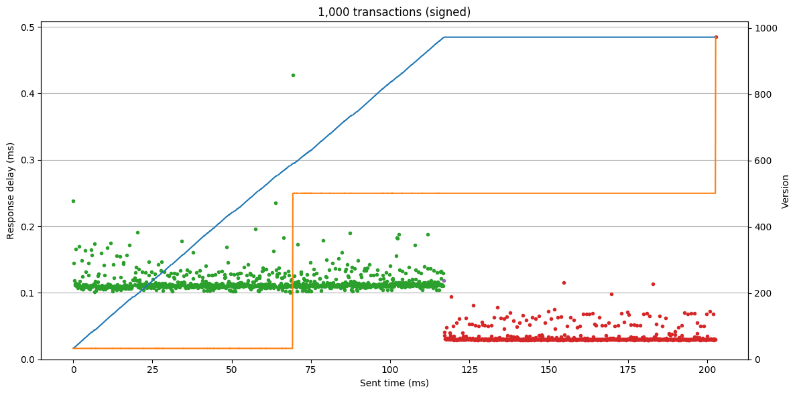

Performance
===========

Overview
--------

CCF pairs strong confidentiality guarantees with `very high performance <TR_>`_. CCF can sustain high transaction throughput, while also reaching consensus over global commits with low latency.

.. _TR: https://github.com/microsoft/CCF/blob/master/CCF-TECHNICAL-REPORT.pdf

There are several performance metrics in the CI test suite to ensure this, ranging from micro-benchmarks of critical systems to end-to-end tests measuring peak throughput. These are run against every PR and commit to the master branch. You can also run these locally to test the configuration of your machines, and use them as a basis for creating performance tests of your own CCF application.

Micro-benchmarks
----------------

The micro-benchmark tests can be run from the CCF build directory:

.. code-block:: bash

    ./tests.sh -VV -L "bench"

These test performance-critical features of CCF such as certificate verification and KV-alterations. As an example, here is sample output of ``tls_bench``:

.. code-block:: bash

    sign:
    ===============================================================================
       Name (baseline is *)   |   Dim   |  Total ms |  ns/op  |Baseline| Ops/second
    ===============================================================================
               sign_384_1byte |       1 |     1.527 | 1527100 | 40.081 |      654.8
        sign_256k1_mbed_1byte |       1 |     0.893 |  893300 | 23.446 |     1119.4
      sign_256k1_bitc_1byte * |       1 |     0.038 |   38100 |      - |    26246.7
                  sign_384_1k |       1 |     1.557 | 1557100 | 40.869 |      642.2
           sign_256k1_mbed_1k |       1 |     0.922 |  922200 | 24.205 |     1084.4
         sign_256k1_bitc_1k * |       1 |     0.041 |   41100 |  1.079 |    24330.9
                sign_384_100k |       1 |     1.782 | 1782100 | 46.774 |      561.1
         sign_256k1_mbed_100k |       1 |     1.268 | 1267700 | 33.273 |      788.8
       sign_256k1_bitc_100k * |       1 |     0.377 |  377300 |  9.903 |     2650.4
    ===============================================================================
    verify:
    ===============================================================================
       Name (baseline is *)   |   Dim   |  Total ms |  ns/op  |Baseline| Ops/second
    ===============================================================================
             verify_384_1byte |       1 |     2.917 | 2917301 | 51.542 |      342.8
      verify_256k1_mbed_1byte |       1 |     1.714 | 1714500 | 30.292 |      583.3
    verify_256k1_bitc_1byte * |       1 |     0.057 |   56600 |      - |    17667.8
                verify_384_1k |       1 |     2.966 | 2966300 | 52.408 |      337.1
         verify_256k1_mbed_1k |       1 |     1.722 | 1721700 | 30.419 |      580.8
       verify_256k1_bitc_1k * |       1 |     0.060 |   59600 |  1.053 |    16778.5
              verify_384_100k |       1 |     3.162 | 3161701 | 55.860 |      316.3
       verify_256k1_mbed_100k |       1 |     2.111 | 2110901 | 37.295 |      473.7
     verify_256k1_bitc_100k * |       1 |     0.398 |  398000 |  7.032 |     2512.6
    ===============================================================================
    hash:
    ===============================================================================
       Name (baseline is *)   |   Dim   |  Total ms |  ns/op  |Baseline| Ops/second
    ===============================================================================
               hash_384_1byte |       1 |     0.001 |     600 |  0.750 |  1666666.7
        hash_256k1_mbed_1byte |       1 |     0.001 |     600 |  0.750 |  1666666.7
      hash_256k1_bitc_1byte * |       1 |     0.001 |     800 |      - |  1250000.0
                  hash_384_1k |       1 |     0.003 |    3100 |  3.875 |   322580.6
           hash_256k1_mbed_1k |       1 |     0.004 |    4200 |  5.250 |   238095.2
         hash_256k1_bitc_1k * |       1 |     0.004 |    4500 |  5.625 |   222222.2
                hash_384_100k |       1 |     0.223 |  223000 |278.750 |     4484.3
         hash_256k1_mbed_100k |       1 |     0.340 |  340100 |425.125 |     2940.3
       hash_256k1_bitc_100k * |       1 |     0.340 |  340400 |425.500 |     2937.7
    ===============================================================================

This compares the signing, verification, and hashing performance of different cryptographic curve implementations in CCF. The `bitcoin-core implementation <bitcoin_256k1_>`_ of elliptic curve secp256k1 is significantly faster than other supported curves, particularly when verification becomes a bottleneck.

End-to-end performance tests
----------------------------

The end-to-end service performance tests can also be from the CCF build directory:

.. code-block:: bash

    ./tests.sh -VV -L "perf"

Each of these tests creates a temporary CCF service on the local machine, then sends a high volume of transactions to measure peak and average throughput. The python test wrappers will print summary statistics including a transaction rate histogram when the test completes. These statistics can be retrieved from any CCF service via the ``getMetrics`` RPC.

For a finer grained view of performance the clients in these tests can also dump the precise times each transaction was sent and its response received, for later analysis. The ``samples`` folder contains a ``plot_tx_times`` Python script which produces plots from this data:

.. code-block:: bash

    cd build
    python ../samples/perf_client/plot_tx_times.py --save-to perf_plot.png single client_0_test_sent.csv client_0_test_recv.csv

The following plot was produced by this script, showing 1,000 transactions sent to the `SmallBank`_ sample application:

.. image:: ../img/1k_unsigned.png

This displays several things:

    * The latency of each request (on the left y-axis), ie the delay between a request being sent and the corresponding response received, distinguishing

        * the business transactions sent to SmallBank application (green dots) 
        * the generic ``commit`` requests used to poll for global commit synchronisation (red dots)

    * The progress of the CCF commit version (on the right axis), showing both

        * the receiving node's locally committed version (blue line)
        * the highest version agreed by the global consensus across the service (orange line)

This shows a healthy service. Response latencies are stable, the local version increases steadily, and the global commit correctly catches up shortly afterwards. Note that the node's local version increments with each processed write transaction but the global commit only changes after longer intervals, increasing in larger steps. The additional delay is from the roundtrip communications required by the consensus protocol, while the step-size is due to the consensus working over `batches` of transactions rather than executing for each transaction individually - in this case the service has batched the first 500 transactions, incrementing the global version to 500.

.. note:: This is an idealised test; the client is sending one transaction at a time to measure minimum latency, the transaction logic is simple, the client is communicating with a local node. This is used to establish an `upper limit` on possible performance.

This can give a direct A/B comparison of various changes. For example, if each request is signed from the client:

Since CCF verifies the signature on every transaction, the per-request time has increased by approximately 3X (verification is very expensive relative to the simple business logic in SmallBank). These signatures are over the secp256k1 curve, verified by the fast `bitcoin <bitcoin_256k1>`_ implementation - a slower curve or implementation would cause a corresponding reduction in the maximum possible throughput.

These plots can also be used over longer tests to gauge outlier severity and frequency, and ensure global commit never lags significantly behind local commit. If the number of requests is increased to 200,000:

.. image:: ../img/200k_unsigned.png
.. image:: ../img/200k_signed.png

.. _bitcoin_256k1: https://github.com/bitcoin-core/secp256k1
.. _SmallBank: https://github.com/microsoft/CCF/tree/master/samples/apps/smallbank
