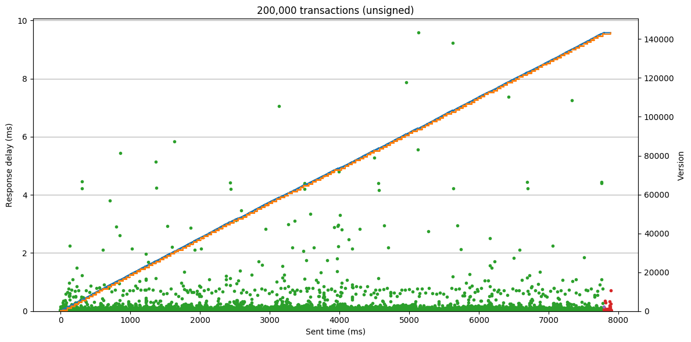

Performance
===========

Overview
--------

While CCF maintains confidentiality over the state and execution of the hosted app, it also offers extremely high performance versus comparable systems. CCF can sustain both high transaction throughputs and low-latency global commit.

There are several performance tests in the CI test suite, including micro-benchmarks of critical systems and end-to-end tests measuring transaction rates on a temporary service. These are run against every PR and commit to the master branch. You can also run these locally to test the configuration of your own machines, and use them as a basis for creating performance tests of your own CCF application.

Micro-benchmarks
----------------

The micro-benchmark tests can be run locally by navigating to the CCF build directory:

.. code-block:: bash

    ./tests.sh -VV -L "bench"

These test performance-critical features of CCF such as certificate verification and KV-alterations. Here is the sample output of the ``tls_bench`` test:

.. code-block:: bash

    sign:
    ===============================================================================
       Name (baseline is *)   |   Dim   |  Total ms |  ns/op  |Baseline| Ops/second
    ===============================================================================
               sign_384_1byte |       1 |     1.527 | 1527100 | 40.081 |      654.8
        sign_256k1_mbed_1byte |       1 |     0.893 |  893300 | 23.446 |     1119.4
      sign_256k1_bitc_1byte * |       1 |     0.038 |   38100 |      - |    26246.7
                  sign_384_1k |       1 |     1.557 | 1557100 | 40.869 |      642.2
           sign_256k1_mbed_1k |       1 |     0.922 |  922200 | 24.205 |     1084.4
         sign_256k1_bitc_1k * |       1 |     0.041 |   41100 |  1.079 |    24330.9
                sign_384_100k |       1 |     1.782 | 1782100 | 46.774 |      561.1
         sign_256k1_mbed_100k |       1 |     1.268 | 1267700 | 33.273 |      788.8
       sign_256k1_bitc_100k * |       1 |     0.377 |  377300 |  9.903 |     2650.4
    ===============================================================================
    verify:
    ===============================================================================
       Name (baseline is *)   |   Dim   |  Total ms |  ns/op  |Baseline| Ops/second
    ===============================================================================
             verify_384_1byte |       1 |     2.917 | 2917301 | 51.542 |      342.8
      verify_256k1_mbed_1byte |       1 |     1.714 | 1714500 | 30.292 |      583.3
    verify_256k1_bitc_1byte * |       1 |     0.057 |   56600 |      - |    17667.8
                verify_384_1k |       1 |     2.966 | 2966300 | 52.408 |      337.1
         verify_256k1_mbed_1k |       1 |     1.722 | 1721700 | 30.419 |      580.8
       verify_256k1_bitc_1k * |       1 |     0.060 |   59600 |  1.053 |    16778.5
              verify_384_100k |       1 |     3.162 | 3161701 | 55.860 |      316.3
       verify_256k1_mbed_100k |       1 |     2.111 | 2110901 | 37.295 |      473.7
     verify_256k1_bitc_100k * |       1 |     0.398 |  398000 |  7.032 |     2512.6
    ===============================================================================
    hash:
    ===============================================================================
       Name (baseline is *)   |   Dim   |  Total ms |  ns/op  |Baseline| Ops/second
    ===============================================================================
               hash_384_1byte |       1 |     0.001 |     600 |  0.750 |  1666666.7
        hash_256k1_mbed_1byte |       1 |     0.001 |     600 |  0.750 |  1666666.7
      hash_256k1_bitc_1byte * |       1 |     0.001 |     800 |      - |  1250000.0
                  hash_384_1k |       1 |     0.003 |    3100 |  3.875 |   322580.6
           hash_256k1_mbed_1k |       1 |     0.004 |    4200 |  5.250 |   238095.2
         hash_256k1_bitc_1k * |       1 |     0.004 |    4500 |  5.625 |   222222.2
                hash_384_100k |       1 |     0.223 |  223000 |278.750 |     4484.3
         hash_256k1_mbed_100k |       1 |     0.340 |  340100 |425.125 |     2940.3
       hash_256k1_bitc_100k * |       1 |     0.340 |  340400 |425.500 |     2937.7
    ===============================================================================

This compares the signing, verification, and hashing performance of different cryptographic curve implementations in CCF. The bitcoin implementation of secp256k1 is significantly faster than other supported curves, particularly for workloads with heavy use of verification.

End-to-end performance tests
----------------------------

The service performance tests can be run locally by navigating to the CCF build directory:

.. code-block:: bash

    ./tests.sh -VV -L "perf"

Each of these tests creates a temporary CCF service on the local machine, then sends a high volume of transactions to measure peak and average throughput. The python test wrappers will print summary statistics including a transaction rate histogram when the test completes. These statistics can be retrieved from any CCF service via the ``getMetrics`` RPC.

For a finer grained view of performance these tests can also dump the precise times each transaction was sent and its response received, for later analysis. The ``samples`` folder contains a ``perf_plot`` Python script demonstrating how this data may be plotted. The following plot was produced by this script, showing 1,000 transactions sent to the SmallBank sample application:

.. image:: img/1k_unsigned.png

* green points are SmallBank business transactions
* red points are generic ``getCommit`` requests used to poll for global commit synchronisation
* blue line shows the receiving node's local commit id
* orange line shows the service's global commit id

This shows a healthy service, with minimal latency responses to each request, write transactions causing an increment to the local commit id, and only a few relatively slow transactions around global commit changes.

Note that this is an idealised test; the client is sending one transaction at a time to measure minimum latency, the app is simple, the client is communicating with a local node. This is used to establish an upper limit on possible performance. This gives a simple A/B comparison of various changes. For example, if each request is signed from the client:

.. image:: img/1k_signed.png

Since CCF now verifies the signature on every transaction. the per-request time has increased by approximately 3X (verification is very expensive relative to the simple business logic in SmallBank). These signatures are over the secp256k1 curve, verified by the fast Bitcoin implementation mentioned above - a slower curve or implementation would cause a corresponding reduction in the maximum possible throughput.

These plots can also be used over longer tests to gauge outlier severity and frequency, and ensure global commit never lags significantly behind local commit. If the number of requests is increased to 200,000:

.. image:: img/200k_signed.png
