# `CommittedRwOrderedSerializableInv` counterexample

## Result

`CommittedRwOrderedSerializableInv` is not an invariant of either bounded
consistency transition system. With `HistoryLimit = 7`, TLC reports the same
shortest counterexample from both the single-node model and the multi-node
model with its normal `ViewLimit = 3`.

The trace has exactly seven external history events, ten transitions, and
eleven states when the initial state is included. Seven is the event count,
not the transition count. The trace requires no view change, read-only
transaction, invalid status, or non-client ledger entry, so it occurs in the
single-node action subset of the multi-node model.

This is a specification-property failure, not a CCF consistency failure. The
property assumes that responses which are adjacent after filtering for
explicitly reported committed transaction IDs are also adjacent ledger
entries. The transition system does not make that assumption, and CCF does not
require it for serialisability.

The property remains defined in `ExternalHistoryInvars.tla` as the target of
the two dedicated expected-counterexample configurations. It is not checked
by the normal multi-node configurations.

## The property

`CommittedRwResponses` contains read-write responses whose transaction IDs
have an explicit committed-status event in `history`, sorted by transaction
ID. The property requires each adjacent pair in that filtered sequence to
differ by exactly the later transaction:

```tla
CommittedRwOrderedSerializableInv ==
    \A i \in 1..Len(CommittedRwResponses)-1:
        CommittedRwResponses[i+1].observed =
            Append(
                CommittedRwResponses[i].observed,
                CommittedRwResponses[i+1].tx)
```

The equality is too strong. An intervening client write can be present in the
ledger and in the later response's observations without having its own
response or committed-status event in the external history.

## Shared deterministic trace

With one worker, both the single-node configuration and the `MCMultiNode.tla`
configuration produce this exact deterministic breadth-first history. The
diagram is the complete transition order, not a projection: its single path
contains all ten transitions and ends at the state 11 violation. Transaction

```mermaid
%%{init: {"theme":"base","themeVariables":{"fontFamily":"Arial, sans-serif","lineColor":"#333333","primaryTextColor":"#111111"}}}%%
flowchart TB
  t1["<b>1. HISTORY 1 - REQUEST tx0</b><br/>MCRwTxRequestAction; history length 1"]
  t2["<b>2. HISTORY 2 - REQUEST tx1</b><br/>MCRwTxRequestAction; history length 2"]
  t3["<b>3. HISTORY 3 - REQUEST tx2</b><br/>MCRwTxRequestAction; history length 3"]
  t4(["<b>4. INTERNAL - EXECUTE tx0</b><br/>view 1, slot 1; history remains 3"])
  t5(["<b>5. INTERNAL - EXECUTE tx1</b><br/>view 1, slot 2; history remains 3<br/><b>Present in ledger; no later response or status</b>"])
  t6(["<b>6. INTERNAL - EXECUTE tx2</b><br/>view 1, slot 3; history remains 3"])
  t7{{"<b>7. HISTORY 4 - RESPONSE tx0</b><br/>ID &lt;&lt;1, 1&gt;&gt;; observed &lt;&lt;0&gt;&gt;<br/><b>Retained once committed at transition 9</b>"}}
  t8{{"<b>8. HISTORY 5 - RESPONSE tx2</b><br/>ID &lt;&lt;1, 3&gt;&gt;; observed &lt;&lt;0, <strong style='color:#B00020'>1 UNEXPECTED</strong>, 2&gt;&gt;<br/><b>Retained once committed at transition 10; unexpected tx1 contribution</b>"}}
  t9{{"<b>9. HISTORY 6 - COMMITTED STATUS &lt;&lt;1, 1&gt;&gt;</b><br/>MCStatusCommittedResponseAction; retains response tx0"}}
  t10{{"<b>10. HISTORY 7 - COMMITTED STATUS &lt;&lt;1, 3&gt;&gt;</b><br/>MCStatusCommittedResponseAction; retains response tx2"}}
  failure[["<b>ANALYSIS - INVARIANT VIOLATION</b><br/>Filtering produces responses tx0 and tx2; tx1 has no response/status.<br/>expected Append(&lt;&lt;0&gt;&gt;, 2) = &lt;&lt;0, 2&gt;&gt;<br/>actual = &lt;&lt;0, <strong style='color:#B00020'>1 UNEXPECTED</strong>, 2&gt;&gt;<br/><b>CommittedRwOrderedSerializableInv is false.</b>"]]

  t1 --> t2
  t2 --> t3
  t3 --> t4
  t4 --> t5
  t5 --> t6
  t6 --> t7
  t7 --> t8
  t8 --> t9
  t9 --> t10
  t10 --> failure

  classDef external fill:#D9EAF7,stroke:#0072B2,stroke-width:3px,color:#111111
  classDef internal fill:#E5E7EB,stroke:#4B5563,stroke-width:3px,color:#111111
  classDef intervening fill:#FDE7B0,stroke:#A85D00,stroke-width:4px,color:#111111
  classDef retained fill:#DFF2E1,stroke:#007A3D,stroke-width:3px,color:#111111
  classDef unexpected fill:#DFF2E1,stroke:#B00020,stroke-width:5px,color:#111111
  classDef violation fill:#FFD6D6,stroke:#B00020,stroke-width:6px,color:#660000
  class t1,t2,t3 external
  class t4,t6 internal
  class t5 intervening
  class t7,t9,t10 retained
  class t8 unexpected
  class failure violation
  linkStyle default stroke:#333333,stroke-width:3px
```

IDs are `<<view, sequence number>>`.



**Legend:** Blue rectangles are ordinary external history events. Gray rounded
nodes are internal execute actions and do not change `history`. The amber
rounded node marks transaction `1`, which is present in the ledger but absent
from response/status filtering. Green hexagons are response/status events
retained by that filtering. Red text and heavy red borders mark the unexpected
transaction `1` contribution and the final invariant violation.

| Transition | State reached | TLC action                        | Relevant result                       | History length |
| ---------: | ------------: | --------------------------------- | ------------------------------------- | -------------: |
|          1 |             2 | `MCRwTxRequestAction` for `0`     | Request `0` is visible                |              1 |
|          2 |             3 | `MCRwTxRequestAction` for `1`     | Request `1` is visible                |              2 |
|          3 |             4 | `MCRwTxRequestAction` for `2`     | Request `2` is visible                |              3 |
|          4 |             5 | `RwTxExecuteAction` for `0`       | Ledger slot 1 is `(view 1, tx 0)`     |              3 |
|          5 |             6 | `RwTxExecuteAction` for `1`       | Ledger slot 2 is `(view 1, tx 1)`     |              3 |
|          6 |             7 | `RwTxExecuteAction` for `2`       | Ledger slot 3 is `(view 1, tx 2)`     |              3 |
|          7 |             8 | `MCRwTxResponseAction` for `0`    | ID `<<1, 1>>`, observes `<<0>>`       |              4 |
|          8 |             9 | `MCRwTxResponseAction` for `2`    | ID `<<1, 3>>`, observes `<<0, 1, 2>>` |              5 |
|          9 |            10 | `MCStatusCommittedResponseAction` | `<<1, 1>>` enters `CommittedTxIDs`    |              6 |
|         10 |            11 | `MCStatusCommittedResponseAction` | `<<1, 3>>` enters `CommittedTxIDs`    |              7 |

State 1 is the initial state. Ten transitions therefore reach state 11.

There is deliberately no response or status event for transaction `1`. In the
final state:

```tla
CommittedTxIDs = {<<1, 1>>, <<1, 3>>}

CommittedRwResponses =
    <<
        [tx |-> 0, tx_id |-> <<1, 1>>, observed |-> <<0>>],
        [tx |-> 2, tx_id |-> <<1, 3>>, observed |-> <<0, 1, 2>>]
    >>
```

The property checks the only adjacent pair and compares:

```text
actual   = <<0, 1, 2>>
expected = Append(<<0>>, 2) = <<0, 2>>
```

The intervening `1` makes the equality false. The weaker
`CommittedRwSerializableInv` still holds because `<<0>>` is a prefix of
`<<0, 1, 2>>`.

In a real ledger, committing sequence number 3 commits the preceding ledger
prefix as well. The abstraction's `CommittedTxIDs`, however, represents
committed statuses explicitly observed by clients, not every transaction
implicitly covered by the commit watermark. Filtering responses with that set
can therefore hide transaction `1` even though later execution observes it.

The trace is minimal for this construction:

1. Three requests and three executions place an intervening write between the
   two compared ledger entries.
2. Two responses expose the observations being compared.
3. Two committed-status events include both outer responses in
   `CommittedRwResponses`.

These are ten transitions. The execution actions do not append to `history`,
so the three requests, two responses, and two statuses produce seven history
events.

## Configuration-specific reproduction

### Single-node configuration

The dedicated single-node configuration uses:

```tla
SPECIFICATION MCSpecSingleNode
HistoryLimit = 7
```

It produces the shared ten-transition, eleven-state trace above.

### Multi-node configuration

The dedicated `MCMultiNode.tla` configuration uses:

```tla
SPECIFICATION MCSpecMultiNode
HistoryLimit = 7
ViewLimit = 3
```

At these bounds `MCMultiNode.tla` produces the exact same linear history,
values, and action order as the single-node run. Although `ViewLimit = 3` is
configured, no view change, truncation, or invalidation occurs because the
shortest witness stays entirely in the embedded `MCNextSingleNodeAction`
subset. The multi-node-only alternatives are enabled but selected zero times.

This is an important containment result rather than a weakness in the
multi-node check. `MCMultiNode.tla` defines:

```tla
MCNextMultiNodeAction ==
    \/ MCNextSingleNodeAction
    \/ MCTruncateLedgerAction
    \/ MCStatusInvalidResponseAction
```

Consequently every single-node behavior is also an allowed multi-node
behavior. A property claimed for all multi-node behaviors must hold for the
embedded subset even when the additional view-change actions are unused.

## Reproduce with TLC

On Ubuntu, install Java, `wget`, and the repository's TLC dependencies:

```bash
sudo apt update
sudo apt install -y default-jre wget
cd tla
python3 install_deps.py
```

From the `tla` directory, run both expected-counterexample checks:

```bash
./tlc_debug.sh --workers 1 --difftrace \
  --trace-name single-node-ordered-serializable \
  --config consistency/MCSingleNodeOrderedSerializableCounterexample.cfg \
  mc consistency/MCSingleNode.tla

./tlc_debug.sh --workers 1 --difftrace \
  --trace-name multi-node-ordered-serializable \
  --config consistency/MCMultiNodeOrderedSerializableCounterexample.cfg \
  mc consistency/MCMultiNode.tla
```

Each dedicated configuration checks only
`CommittedRwOrderedSerializableInv`, as required by `tlc_debug.sh`. TLC
reports:

```text
Error: Invariant CommittedRwOrderedSerializableInv is violated.
...
Counterexample found as expected.
```

The single-node command generates 12,390 states and 8,846 distinct states.
The multi-node command at `ViewLimit = 3` generates 134,561 states and 63,978
distinct states. Both stop at the same state 11 violation. Counts are from
deterministic one-worker runs with the repository-installed TLC dependencies.

## Why existing model checking missed it

The normal `MCMultiNode.cfg` and `MCMultiNodeReads.cfg` configurations both
set:

```tla
HistoryLimit = 6
```

Seven external events are necessary: three requests create the ledger entries,
two responses provide the pair to compare, and two committed-status events
include that pair in the filtered sequence. With `HistoryLimit = 6`, TLC
exhaustively checks the bounded state graph but cannot reach the violating
state. Raising only this bound to 7 exposes the counterexample.

The bound predates the property. It was established with the original
consistency specification in commit
[`724c827247`](https://github.com/microsoft/CCF/commit/724c827247)
([PR #5699](https://github.com/microsoft/CCF/pull/5699)). Commit
[`bf4fcff670`](https://github.com/microsoft/CCF/commit/bf4fcff670)
([PR #6185](https://github.com/microsoft/CCF/pull/6185)) later introduced
`CommittedRwOrderedSpecLinearizableInv` as a multi-node ordered speculative
linearizability check. That change wired the composite invariant only into
`MCMultiNode.cfg` and `MCMultiNodeReads.cfg`; it did not add it to the
single-node configuration or change `HistoryLimit`.

The configuration placement does not limit the property's domain. The
multi-node model extends the single-node model, and
`MCNextMultiNodeAction` explicitly contains `MCNextSingleNodeAction`.
`MCSingleNodeOrderedSerializableCounterexample.cfg` is therefore a valid
minimal diagnostic witness for a property that was originally enabled only
in multi-node configurations. The dedicated multi-node run independently
confirms that the same witness is present at the original `ViewLimit = 3`.

The other configurations did not close the gap:

- The single-node configurations used a history limit of 7 but did not check
  the new property.
- `MCMultiNodeReadsAlt.cfg` used a larger history limit but did not check the
  new property.
- The configurations which checked the property remained capped at 6.

This was a scope-boundary blind spot, not a TLC search failure.

## Why the property fails

PR #6185 intended to state that committed read-write transactions are
serialisable in transaction-ID order. Its formula selects only responses with
explicitly observed committed statuses, sorts that filtered set, and then
treats adjacent elements as adjacent ledger writes.

Those notions of adjacency differ:

- Adjacent in `CommittedRwResponses` means no other response with an explicit
  committed-status event is between the pair.
- Adjacent in the ledger means no client write is between their sequence
  numbers.

The transition system permits a write to execute without a response or status
event. Such a write is absent from `CommittedRwResponses` but remains present
in every later observation of that ledger prefix. The `Append` equality
therefore cannot hold in general.

A replacement property requires a separate design decision. For example, it
could allow an observed suffix between the compared writes, or the abstraction
could distinguish actual ledger commitment from client receipt of a committed
status. This counterexample does not assert a replacement guarantee.
